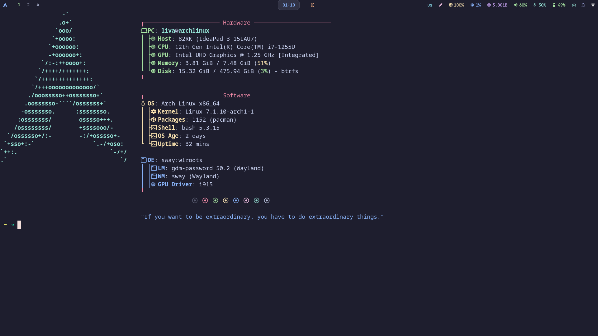
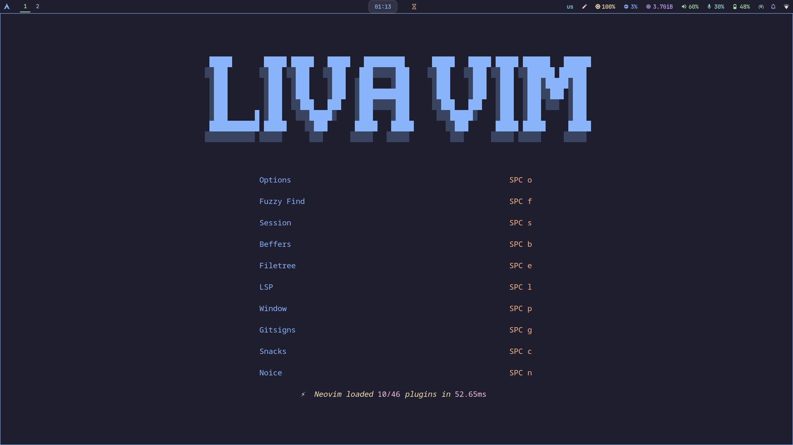
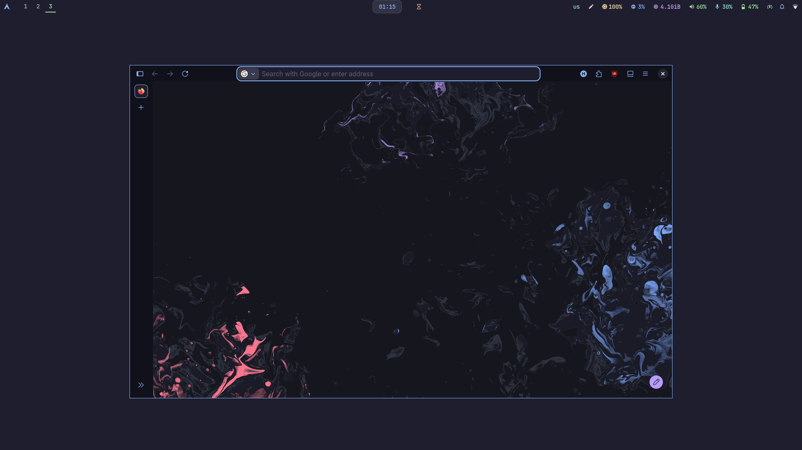

<div align="center">

[](https://opensource.org/licenses/MIT)
[](https://swaywm.org/)
[](https://alacritty.org/)
[](https://neovim.io/)
[](https://zsh.org/)
[](https://starship.rs/)
[](https://archlinux.org/)
[](https://nixos.org/)
[](https://github.com/catppuccin/catppuccin)

</div>

<br/>

<div align="center">


</div>

---

## 🖥️ About

A minimal, aesthetic, and highly configured Linux dotfiles setup running on **Sway** (Wayland/wlroots).
Every dotfile is managed with a bare Git repo — clone it and `dotfiles checkout` to get everything running.

---

## 📸 Gallery

| Desktop | Terminal |
|:---:|:---:|
|  |  |

| Configs | Wallpapers |
|:---:|:---:|
|  |  |

---

## 📦 Configs

| App | Description |
|:---|:---|
| **Sway** | Tiling Wayland compositor (wlroots) |
| **Alacritty** | GPU-accelerated terminal emulator |
| **Kitty** | Fast, feature-rich terminal |
| **Neovim** | Hacked Vim — config & plugins |
| **Zsh** | Shell with Oh My Zsh & Starship prompt |
| **Fish** | Smart and user-friendly shell |
| **Fastfetch** | Fast system info fetch |
| **Rofi** | Application launcher & window switcher |
| **Waybar** | Modern status bar for Wayland |
| **Swaylock** | Screen locker |
| **Swaync** | Notification center |
| **Starship** | Cross-shell prompt |
| **NixOS** | Declarative system config |
| **Wallpaper** | Desktop backgrounds |

---

## ⚡ Quick Start

```bash
# Clone your bare dotfiles repo
git clone --bare <repo-url> $HOME/.dotfiles

# Add the alias
echo "alias dotfiles='/usr/bin/git --git-dir=\$HOME/.dotfiles/ --work-tree=\$HOME'" >> \$HOME/.zshrc

# Reload shell
source \$HOME/.zshrc

# Deploy everything
dotfiles checkout

# Hide untracked files from status
dotfiles config --local status.showUntrackedFiles no
```

---

## 🛠️ Stack

```
┌─────────────────────────────────────┐
│          Sway WM (wlroots)          │
│   ┌─────────────────────────────┐   │
│   │      Alacritty / Kitty      │   │
│   │  ┌───────────────────────┐  │   │
│   │  │      Neovim           │  │   │
│   │  └───────────────────────┘  │   │
│   └─────────────────────────────┘   │
│  ┌──────┐  ┌──────┐  ┌──────────┐  │
│  │ Rofi │  │Waybar│  │ Swaylock │  │
│  └──────┘  └──────┘  └──────────┘  │
└─────────────────────────────────────┘
         Zsh + Starship · Fish
         Fastfetch · NixOS · Catppuccin Mocha
```

---

## 🎨 Theme

**Catppuccin Mocha** — warm pastel colors with a dark aesthetic across all applications.

---

## 📜 License

This project is licensed under the MIT License — see the [LICENSE](LICENSE) file for details.

---

<div align="center">

*“If you want to be extraordinary, you have to do extraordinary things.”*

</div>
