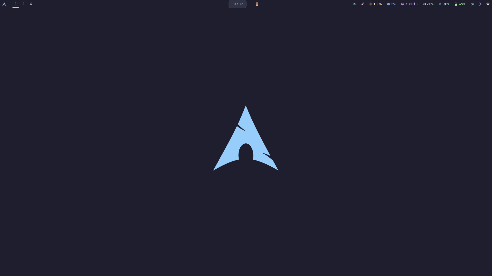

# My dotfiles

<div align="center">



</div>

---
## 📦 Configs

| App | Description |
|:---|:---|
| **Sway** | Tiling Wayland compositor (wlroots) |
| **Alacritty** | GPU-accelerated terminal emulator |
| **Kitty** | Fast, feature-rich terminal |
| **Neovim** | Hacked Vim — config & plugins |
| **Zsh** | Shell with Oh My Zsh & Starship prompt |
| **Fish** | Smart and user-friendly shell |
| **Fastfetch** | Fast system info fetch |
| **Rofi** | Application launcher & window switcher |
| **Waybar** | Modern status bar for Wayland |
| **Swaylock** | Screen locker |
| **Swaync** | Notification center |
| **Starship** | Cross-shell prompt |
| **NixOS** | Declarative system config |
| **Wallpaper** | Desktop backgrounds |

---

## Guide for Managing Dotfiles with a Bare Git Repository

This guide explains how to use a bare Git repository to manage your dotfiles (configuration files in your home directory).

### What is a Bare Git Repository?

A bare Git repository is a repository that doesn't have a working directory. This means it doesn't have a copy of your files checked out. It only contains the Git data, which is usually stored in the `.git` directory.

For managing dotfiles, a bare repository is ideal because you can have your dotfiles in your home directory without having a `.git` subdirectory and without having to move your files into a versioned directory.

### How to Create a Bare Repository

1.  **Initialize the bare repository:**

    ```bash
    git init --bare $HOME/.dotfiles
    ```

    This creates a directory named `.dotfiles` in your home directory, which will store your versioned dotfiles' history.

2.  **Create an alias for easier use:**

    Add the following alias to your shell's configuration file (e.g., `.bashrc`, `.zshrc`):

    ```bash
    alias dotfiles='/usr/bin/git --git-dir=$HOME/.dotfiles/ --work-tree=$HOME'
    ```

    This alias allows you to run git commands for your dotfiles repository from anywhere by using `dotfiles` instead of `git`.

3.  **Reload your shell configuration:**

    ```bash
    source ~/.bashrc  # or ~/.zshrc
    ```

### How to Set It Up

1.  **Configure the repository to not show untracked files:**

    By default, the repository will show all files in your home directory as untracked. To change this, run:

    ```bash
    dotfiles config --local status.showUntrackedFiles no
    ```

2.  **Add files to the repository:**

    Now you can start adding your dotfiles to the repository.

    ```bash
    dotfiles add .bashrc
    dotfiles add .vimrc
    dotfiles add .config/nvim/init.vim
    ```

3.  **Commit your files:**

    ```bash
    dotfiles commit -m "Add initial dotfiles"
    ```

4.  **Push to a remote repository (optional but recommended):**

    Create a new repository on a service like GitHub or GitLab and then push your local repository to it.

    ```bash
    dotfiles remote add origin <remote_repository_url>
    dotfiles push -u origin master
    ```

### How to Use It

#### Adding New Files

To add new dotfiles, use the `dotfiles add` command:

```bash
dotfiles add .tmux.conf
dotfiles commit -m "Add tmux configuration"
dotfiles push
```

#### Cloning on a New Machine

To set up your dotfiles on a new machine:

1.  **Clone the repository:**

    ```bash
    git clone --bare <remote_repository_url> $HOME/.dotfiles
    ```

2.  **Add the alias** to your shell's configuration file as described above.

3.  **Reload your shell configuration.**

4.  **Checkout the files:**

    ```bash
    dotfiles checkout
    ```

    If you get an error about your local files being overwritten, you can either back them up or force the checkout:

    ```bash
    dotfiles checkout -f
    ```

5.  **Configure the repository to not show untracked files:**

    ```bash
    dotfiles config --local status.showUntrackedFiles no
    ```

Now your dotfiles are managed by your bare repository on the new machine.

---
